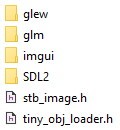

# apeiron

Requires [SDL2](https://www.libsdl.org/), [GLEW](https://github.com/nigels-com/glew), [glm](https://glm.g-truc.net/0.9.8/index.html), [tinyobjloader](https://github.com/syoyo/tinyobjloader), [stb_image.h](https://github.com/nothings/stb) and [dear imgui](https://github.com/ocornut/imgui). These libraries are not part of this repo and must be put in an *external* directory within the *root* directory.

See usage examples [here](https://github.com/mwkpe/apeiron-examples).

Status
---
WIP and [relearning OpenGL](https://learnopengl.com/)
